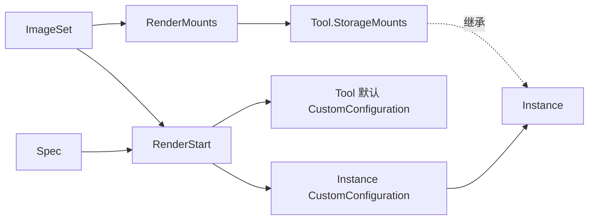

# Sandcamp SDK Cookbook

这里集中展示 Sandcamp 的 Go SDK 用法，包括：

- 使用 `RenderMounts` 生成 Runtime 与 Sidecar Image Volume 挂载；
- 使用 `RenderStart` 生成 Tool 默认配置和 Instance 覆盖配置；
- Main 使用数字 UID/GID，Sidecar 使用镜像内用户名；
- 使用官方 AGS Go SDK 创建 Tool、启动 Instance，并在 Smoke Test 后自动清理。

离线查看和测试只依赖 Go；可选的 AGS Smoke Test 需要腾讯云凭证和可用镜像。

## 先运行

```bash
# 编译并校验示例，以及可执行的 Go Example 文档
go test ./examples/cookbook

# 查看 ImageSet、Spec、StorageMounts、CustomConfiguration 和解码后的内部声明
go run ./examples/cookbook

# 查看完整的 CreateSandboxTool 与 StartSandboxInstance 请求
go run ./examples/cookbook requests

# 查看命令说明
go run ./examples/cookbook help
```

`inspect` 是默认命令，以下两条命令等价：

```bash
go run ./examples/cookbook
go run ./examples/cookbook inspect
```

## 配置关系



核心调用只有两个：

```go
mounts, err := sandcamp.RenderMounts(images)
if err != nil {
    return err
}
configuration, err := sandcamp.RenderStart(images, processes)
if err != nil {
    return err
}
```

输出按下面的方式接入官方 AGS SDK：

```go
toolRequest.StorageMounts = append(toolRequest.StorageMounts, mounts...)

toolConfiguration := *configuration
toolConfiguration.Image = &mainImage
toolConfiguration.ImageRegistryType = &registryType
toolRequest.CustomConfiguration = &toolConfiguration

startRequest.CustomConfiguration = configuration
// MountOptions 保持 nil，继承 Tool.StorageMounts。
```

AGS 创建 custom Tool 时强制要求默认 `Command` 和 `Probe`，所以 Tool 也必须使用
`RenderStart` 的结果，不能只填写主镜像。Instance 可以按每次启动所需的 `Spec`
重新调用 `RenderStart` 覆盖默认配置。

可直接阅读的完整实现：

- [`recipe.go`](recipe.go)：镜像与进程声明；
- [`requests.go`](requests.go)：Tool/Instance 请求组合；
- [`smoke.go`](smoke.go)：可选的 AGS 生命周期验证和自动清理；
- [`example_test.go`](example_test.go)：最小、可由 `go test` 校验的 SDK 示例。

## 默认 Recipe

默认声明展示下面的进程组合：

| 进程 | 根文件系统 | 身份 | 启动检查 |
| --- | --- | --- | --- |
| Main | AGS 主镜像 | `65532:65532` | `GET 127.0.0.1:8080/healthz` |
| Egress | 独立 Image Volume | root | `GET 127.0.0.1:24774/healthz` |
| FastAPI | 独立 Image Volume | 镜像用户 `app` → `65532:65532` | `GET 127.0.0.1:9200/healthz` |

`recipe.go` 使用不可拉取的 `registry.example.com` 占位引用，避免示例意外依赖
特定镜像仓库。运行 AGS Smoke Test 前必须通过环境变量替换镜像；如果镜像的路径
布局或进程契约不同，还需要同步修改 Command、WorkDir、Env 和用户声明：

| 环境变量 | 用途 |
| --- | --- |
| `SANDCAMP_COOKBOOK_REGISTRY_TYPE` | 所有示例镜像的 Registry 类型 |
| `SANDCAMP_COOKBOOK_MAIN_IMAGE` | 主业务镜像 |
| `SANDCAMP_COOKBOOK_RUNTIME_IMAGE` | 包含 campd、sandrun 的 Runtime 镜像 |
| `SANDCAMP_COOKBOOK_FASTAPI_IMAGE` | FastAPI Sidecar 镜像 |
| `SANDCAMP_COOKBOOK_EGRESS_IMAGE` | Egress Sidecar 镜像 |

主业务镜像直接填写到 Tool `CustomConfiguration.Image`，不放进 `ImageSet`。
`ImageSet` 只描述 Sandcamp Runtime 和 Sidecar Image Volume；每个
`SidecarImage.Name` 必须与对应的 `Process.Name` 相同。

## 进程声明约束

Sidecar 的 `Command`、`WorkDir` 和 `Env` 都是切换到该镜像根文件系统后看到的
值。业务代码不应自行拼接以下实现细节：

- `/mnt/sandcamp/bin/sandrun`；
- `--rootfs`、`--overlay-device` 或 `--overlay-id`；
- sandrun 的 `--` 命令分隔符；
- Runtime 和 Sidecar Image Volume 的挂载路径。

调用方只需把镜像内的完整 argv 写入 `Process.Command`，`RenderStart` 会生成完整的
sandrun 命令行。`RenderStart` 返回的顶层 `Args=["--"]` 则用于覆盖主镜像原有
`CMD`，与 sandrun 的命令分隔符用途不同。

Image Volume 只提供镜像文件，不会自动应用 Sidecar OCI Config。调用方必须显式
恢复所需字段：

| OCI 字段 | Sandcamp 声明 |
| --- | --- |
| `Entrypoint` + `Cmd` | `Process.Command` |
| `Env` | `Process.Env` |
| `WorkingDir` | `Process.WorkDir` |
| 对外端口 | `Process.Expose` |
| HTTP 启动检查 | `Process.StartupProbe` |

Main 保留主镜像 OCI `ENV` 和 AGS 注入的环境，再由 `Process.Env` 覆盖。Sidecar
会清空继承环境，只接收自己的 `Process.Env`，因此通常需要显式提供 `PATH`、
`HOME` 和业务配置。

## 用户身份

Main 使用数字身份：

```go
User: &sandcamp.ProcessUser{UID: 65532, GID: 65532}
```

Sidecar 使用镜像内用户名：

```go
User: &sandcamp.ProcessUser{Name: "app"}
```

`app` 必须存在于 Sidecar 镜像 immutable lower 层的 `/etc/passwd`。sandrun 会以
root 完成 Mount Namespace、OverlayFS、挂载、`pivot_root` 和 `WorkDir` 切换，
随后清空附加组与 Capabilities、设置 `no_new_privs`，最后切换到 passwd 中的
UID/主 GID。用户缺失或 passwd 非法时启动失败，不会回退 root。

命名用户不会自动设置 `HOME`、`USER` 或 `LOGNAME`，这些仍属于 `Process.Env`。
当前不支持 `user:group`、NSS/LDAP、Sidecar 数字 UID/GID 或 Supplementary Groups
解析。

## 探针模型

AGS 只接收一个平台探针：`GET /ready`，端口 `49982`。campd 在内部按顺序启动
Sidecar 和 Main，并等待每个 `Process.StartupProbe`；全部成功后才让 `/ready`
返回成功。

`RenderStart` 将所有进程的启动探针总预算限制为 25 秒，为 AGS 的 30 秒就绪期限保留
进程创建和调度时间。探针只负责启动门禁，不做持续健康检查；campd 不自动重启
进程，但任一由 campd 管理的进程退出都会使 campd 退出，从而结束 Instance。

只有需要外部访问的端口才写入 `Expose`。Egress 的 `24774` 和 Main 的 `8080`
只供沙箱内部启动检查，因此默认只向 AGS 暴露 FastAPI 的 `9200`。

## AGS Smoke Test

下面的命令会创建临时 Tool、等待 `ACTIVE`、启动 Instance、等待 `RUNNING`，随后
停止 Instance 并删除 Tool：

```bash
export TENCENTCLOUD_SECRET_ID=...
export TENCENTCLOUD_SECRET_KEY=...
export TENCENTCLOUD_REGION='<region>'
export AGS_ROLE_ARN='qcs::cam::uin/...:roleName/...'

go run ./examples/cookbook smoke
```

使用临时凭证时另外提供 `TENCENTCLOUD_TOKEN`。程序收到中断或中途失败时也会尽力
清理已经创建的资源；若自动清理失败，会把资源 ID 和错误写入标准错误。

## 登录后的验证方式

默认 Smoke Test 会在 `RUNNING` 后立即清理。如果需要保留 Instance 供手工登录，
必须显式启用保留模式：

```bash
SANDCAMP_COOKBOOK_KEEP_RESOURCES=1 go run ./examples/cookbook smoke
```

命令会输出 Tool ID 和 Instance ID，但不会自动清理。检查结束后必须通过 AGS API
或控制台停止 Instance 并删除 Tool。

登录后可以在沙箱中检查：

```bash
ps -eo pid,ppid,user,group,args

python - <<'PY'
import urllib.request
for port, path in ((49982, "/ready"), (8080, "/healthz"),
                   (9200, "/healthz"), (24774, "/healthz")):
    response = urllib.request.urlopen(f"http://127.0.0.1:{port}{path}")
    print(port, response.status)
PY
```

主进程、campd 和所有 Sidecar 共享 PID 与 Network Namespace，因此可以直接看到
全部进程并访问 Loopback 端口。Sidecar 各自拥有独立 Mount Namespace 和
OverlayFS 根文件系统；它们不是独立容器，也不构成 PID、Network、User、IPC 或
cgroup 安全隔离边界。

## 运行前检查

- [ ] 主业务镜像只配置在 Tool `CustomConfiguration.Image`。
- [ ] Runtime 和每个 Sidecar 都已加入 `ImageSet`。
- [ ] Sidecar Image Name 与 Process Name 一一对应。
- [ ] `Process.Command` 和 `WorkDir` 都是镜像内绝对路径。
- [ ] Sidecar 显式提供所需的 OCI 环境变量。
- [ ] 命名用户存在于镜像 `/etc/passwd`，并显式设置所需身份环境变量。
- [ ] 只把外部访问端口写入 `Expose`。
- [ ] 启动探针总预算不超过 25 秒。
- [ ] Tool 默认配置和 Instance 覆盖都来自 `RenderStart`。
- [ ] Instance 不发送 `MountOptions`，继承 Tool `StorageMounts`。
- [ ] Egress allowlist 已替换为生产规则，或明确移除 Egress。
- [ ] `go test ./examples/cookbook` 和适用环境中的 Smoke Test 均通过。

完整字段限制见 [`API 参考`](../../docs/api-reference.md)，运行原理见
[`技术方案`](../../docs/design.md)，常见问题见
[`排障手册`](../../docs/troubleshooting.md)，验证状态见
[`验证记录`](../../docs/validation.md)。
